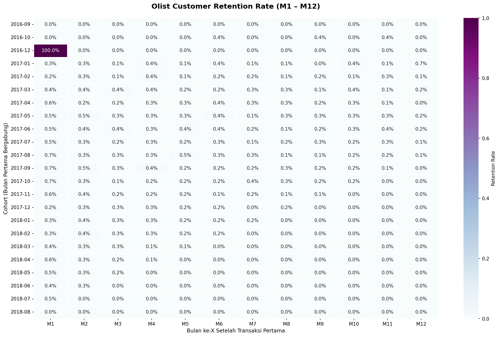
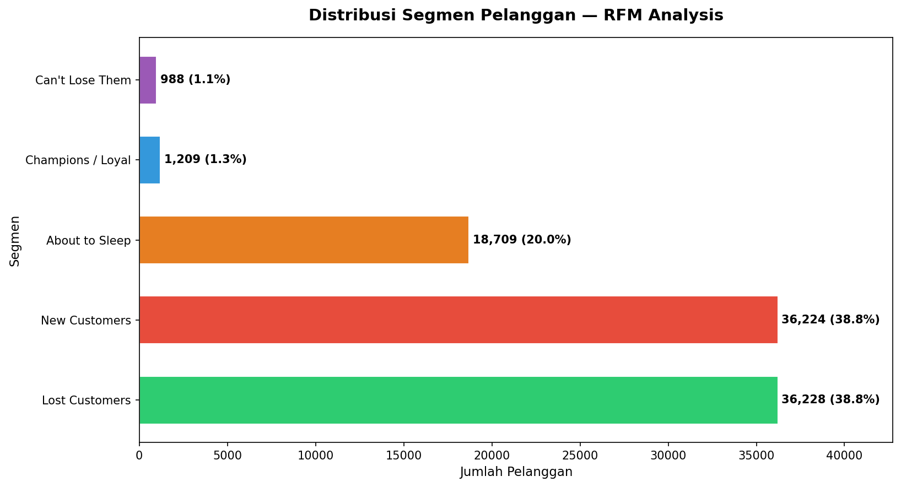

# Brazilian E-Commerce (Olist) - Customer Analytics

Analisis perilaku pelanggan menggunakan **Cohort Retention Analysis** dan **RFM Segmentation** pada dataset publik Olist, platform e-commerce terbesar di Brasil dengan 100k+ transaksi nyata (2016–2018).

---

## Business Problem

Platform e-commerce sering terjebak dalam siklus yang tidak sehat: terus mengakuisisi pelanggan baru tanpa memahami mengapa pelanggan lama tidak kembali. Proyek ini menjawab dua pertanyaan bisnis utama:

1. **Seberapa parah masalah retensi Olist?**
2. **Siapa pelanggan paling bernilai, dan apa yang harus dilakukan terhadap masing-masing segmen?**

---

## Key Findings

**Retensi runtuh di bulan pertama.** Rata-rata kurang dari 2% pelanggan kembali berbelanja setelah bulan pertama. Platform ini bertahan karena volume akuisisi baru, bukan loyalitas, sebuah model yang mahal dan tidak berkelanjutan jangka panjang.

**Dominasi segmen pasif.** Lost Customers (~36.000 user) hampir identik jumlahnya dengan New Customers (~36.000 user), artinya Olist kehilangan pelanggan dengan kecepatan yang sama seperti mendapatkan yang baru.

**Champions tersembunyi.** Hanya ~1.200 pelanggan masuk segmen Champions / Loyal, tapi rata-rata monetary mereka jauh di atas segmen lain. Kehilangan satu Champions setara kehilangan puluhan New Customers dari sisi revenue.

---

## Visualizations

**Cohort Retention Heatmap (M1–M12)**



**RFM Segment Distribution**



---

## Tech Stack

| Tool | Kegunaan |
|---|---|
| Python (Pandas) | Data loading, merging, cleaning |
| SQL (SQLite) | Core analysis — cohort aggregation, RFM scoring |
| Matplotlib + Seaborn | Visualisasi heatmap dan distribusi segmen |

SQL dipilih sebagai core analysis engine karena lebih efisien dan readable untuk operasi window dan grouping dibanding pandas murni.

---

## Project Structure

```
olist-ecommerce-customer-analytics/
├── notebooks/
│   └── olist_ecommerce_customer_analytics_v2.ipynb
├── outputs/
│   ├── cohort_retention_heatmap.png
│   ├── rfm_segment_distribution.png
│   └── olist_rfm_segments.csv
├── README.md
└── requirements.txt
```

---

## How to Run

1. Download dataset dari [Kaggle — Brazilian E-Commerce Public Dataset by Olist](https://www.kaggle.com/datasets/olistbr/brazilian-ecommerce)
2. Letakkan file CSV di direktori yang sama dengan notebook
3. Install dependencies:
```bash
pip install pandas matplotlib seaborn
```
4. Jalankan notebook dari awal secara berurutan

---

## Strategic Recommendations

| Segmen | Aksi | Timeline | Estimasi Impact |
|---|---|---|---|
| New Customers | Email trigger + kupon D+7 setelah delivered | Minggu 1–2 | +BRL 540k/siklus (asumsi konversi 10%) |
| About to Sleep | Win-back campaign berbasis kategori produk | Minggu 2–4 | Cegah migrasi ke Lost |
| Champions | Program VIP + monitoring bulanan R_score | Ongoing | Jaga revenue per kepala tertinggi |
| Lost Customers | Reaktivasi hemat biaya, prioritas rendah | Kuartal berikutnya | ROI rendah tapi skala besar |

Detail metodologi dan reasoning di balik setiap rekomendasi tersedia di bagian akhir notebook.

---

## Dataset

[Brazilian E-Commerce Public Dataset by Olist](https://www.kaggle.com/datasets/olistbr/brazilian-ecommerce) - Kaggle  
Lisensi: CC BY-NC-SA 4.0
